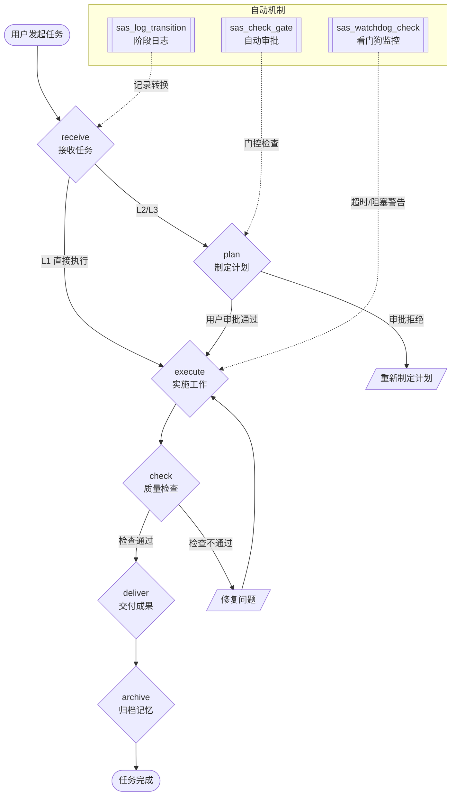

[](https://github.com/terlivy/SAS-plug-in)
[](https://github.com/terlivy/SAS-plug-in/releases)
[](#插件分类)
[](#环境要求)

# SAS Engine

> SAS v1.5 六阶段门控流水线 — OpenClaw 核心任务执行引擎插件

## 概述

SAS Engine 是 SnoopyClaw 的核心任务执行引擎插件，实现了 **SAS v1.5 CEO 工作准则**的六阶段门控流水线，具备以下特性：

- 自动审批（满足条件时跳过人工确认）
- 阶段转换日志持久化
- 看门狗监控（超时 / 阻塞检测）
- 任务状态持久化
- L1/L2/L3 复杂度分级

**最新版本：v1.1.0**（支持 SAS v1.5 receive/plan/execute/check/deliver/archive 六阶段）

---

## 环境要求

| 项目 | 要求 |
|------|------|
| OpenClaw | ≥ 2026.3 |
| Node.js | ≥ 18 |
| 系统 | Linux / WSL Ubuntu-22.04 |

---

## 插件分类

| 分类 | 插件 | 说明 |
|------|------|------|
| **工作流引擎** | `sas-engine` | 六阶段门控、自动审批、看门狗 |
| **记忆系统** | `memory-lancedb-pro` | 向量记忆 + Smart Extraction |
| **上下文管理** | `lossless-claw-enhanced` | DAG 摘要压缩 |
| **飞书集成** | `feishu_*`（7个） | 文档/消息/日历/表格等 |
| **内容安全** | `*content-moderation*`（规划中） | 语料检测、工单系统等 |

> 插件统一采用 **kebab-case** 命名（例：`sas-engine`、`memory-lancedb-pro`）。
> 仓库名 `SAS-plug-in` 与 npm 包名 `@sas-engine/plugin` 保持可理解性；建议统一在 README 文档中标注插件真实 ID 为 `sas-engine`。

---

## 架构



### 核心模块

| 模块 | 文件 | 职责 |
|------|------|------|
| `PhaseEngine` | `src/phase-engine.ts` | 阶段顺序验证、门控检查、Entry/Exit Criteria |
| `ApprovalEngine` | `src/approval-engine.ts` | 自动审批规则（Token预算、影响范围、修复时间） |
| `Watchdog` | `src/watchdog.ts` | 超时警告、阻塞恢复、空闲快照 |
| `StateMachine` | `src/state-machine.ts` | 任务状态读写、日志持久化 |

---

## 六阶段定义

| 阶段 | 名称 | Entry Criteria | Exit Criteria |
|------|------|----------------|---------------|
| `receive` | 接收任务 | 接收用户指令，确认需求 | 任务 ID 生成、复杂度已评估（L1/L2/L3） |
| `plan` | 制定计划 | 复杂度 > L1 | 计划文档生成，用户审批通过 |
| `execute` | 实施工作 | 计划已审批 | 主体工作完成，无阻塞 |
| `check` | 质量检查 | 实施完成 | 自检报告 100%，覆盖率达标 |
| `deliver` | 交付成果 | 检查通过 | 交付物已发送，用户确认 |
| `archive` | 归档记忆 | 交付完成 | memory 已写入，GitHub 已同步 |

---

## 复杂度分级

| 等级 | 判断标准 | 处理方式 |
|------|----------|----------|
| **L1** | 单步、无风险、无外部依赖 | 直接执行，快速通道（自动审批） |
| **L2** | 2-3 个子 Agent、4-8 步、有依赖关系 | 标准 SAS 流程，需计划审批 |
| **L3** | 3+ Agent、8+ 步、跨系统、高风险 | 完整 CEO 模式，需详细方案审批 |

---

## 已注册工具

| 工具名称 | 功能描述 | 参数 | 返回值 |
|----------|----------|------|--------|
| `sas_check_gate` | 阶段门控检查 — 验证当前阶段是否能转换到下一阶段 | `{taskId, currentPhase, nextPhase, context}` | `{approved, reason, auto}` |
| `sas_log_transition` | 记录阶段转换日志 | `{taskId, from, to, reason}` | `{logged, timestamp}` |
| `sas_watchdog_check` | 看门狗检查 — 扫描卡住/超时的任务（无参数） | — | `{warnings[], recoveries[]}` |
| `sas_get_task_state` | 获取任务当前状态 | `{taskId}` | `{phase, history[], metrics{...}}` |

### 工具调用示例

**sas_check_gate**
```json
// 请求
{
  "taskId": "project-alpha-001",
  "currentPhase": "receive",
  "nextPhase": "plan",
  "context": {
    "complexity": "L2",
    "hasPlan": true,
    "hasRiskAssessment": true,
    "estimatedTokens": 5000
  }
}
// 响应
{
  "approved": true,
  "reason": "自动审批通过（L1 快速通道）",
  "auto": true
}
```

**sas_watchdog_check**（无参数）
```json
{
  "warnings": [
    {
      "taskId": "stuck-001",
      "reason": "任务超过 30 分钟无进展",
      "since": "2026-04-08T10:30:00Z"
    }
  ],
  "recoveries": [
    {
      "taskId": "recovered-001",
      "action": "已自动恢复阻塞的任务"
    }
  ]
}
```

**sas_get_task_state**
```json
{
  "taskId": "project-alpha-001",
  "phase": "execute",
  "startedAt": "2026-04-08T09:00:00Z",
  "history": [
    {"from": null, "to": "receive", "at": "2026-04-08T09:00:00Z"},
    {"from": "receive", "to": "plan", "at": "2026-04-08T09:01:00Z"},
    {"from": "plan", "to": "execute", "at": "2026-04-08T09:05:00Z"}
  ],
  "metrics": {
    "estimatedTokens": 5000,
    "actualTokens": 3200,
    "subAgentsUsed": ["sas-leader"]
  }
}
```

---

## 快速开始

### 安装

插件已注册到 OpenClaw，配置如下（`~/.openclaw/openclaw.json`）：

```json
{
  "plugins": {
    "allow": ["sas-engine"],
    "load": {
      "paths": ["/home/openclaw/.openclaw/extensions/sas-engine"]
    },
    "entries": {
      "sas-engine": {
        "enabled": true
      }
    }
  }
}
```

### 编译

```bash
cd /home/openclaw/.openclaw/extensions/sas-engine
npm install
npm run build
```

### 重启 OpenClaw Gateway

```bash
# 使用 safe-restart 脚本（不断开现有连接）
~/clawd/scripts/safe-gateway-restart.sh "sas-engine 安装后加载"

# 或手动重启
openclaw gateway restart
```

### 验证插件加载

```bash
openclaw --agent main --local "你遵循什么工作准则？"
# 应返回 SAS v1.5 六阶段流程（receive/plan/execute/check/deliver/archive）
```

---

## 目录结构

```
sas-plug-in/
├── README.md                    # 本文档
├── openclaw.plugin.json         # 插件元数据（id: sas-engine, version: 1.1.0）
├── package.json                 # npm 包配置
├── tsconfig.json                # TypeScript 配置
├── src/
│   ├── index.ts                 # 插件入口，SASEngine 类导出
│   ├── phase-engine.ts          # 六阶段门控引擎（核心）
│   ├── approval-engine.ts       # 自动审批逻辑
│   ├── watchdog.ts              # 看门狗监控
│   └── state-machine.ts        # 任务状态持久化
└── dist/                        # 编译产物（TypeScript → JavaScript）
```

---

## 版本历史

| 版本 | 日期 | 更新内容 |
|------|------|----------|
| **v1.1.0** | 2026-04-08 | 修复：阶段名升级到 SAS v1.5；补充 README 完整内容（架构图、工具详情、分类表、FAQ）；`openclaw.plugin.json` 补全 `id`/`version` 字段 |
| v1.0.0 | 2026-04-08 | 修复：阶段名升级到 SAS v1.5（receive/plan/execute/check/deliver/archive） |
| v1.0.0-beta.1 | 2026-04-02 | 初始版本，六阶段门控引擎 + 看门狗 + 状态机 |

---

## 故障排查

### 编译失败
```bash
# 检查 TypeScript 版本
npm run build 2>&1 | grep -i error

# 重新安装依赖
rm -rf node_modules && npm install
```

### 工具未注册
```bash
# 检查插件是否被 OpenClaw 识别
openclaw gateway status 2>&1 | grep -i sas

# 查看插件加载日志
openclaw gateway logs 2>&1 | grep -i sas-engine
```

### 版本不匹配
```bash
# 当前加载的插件版本
openclaw --agent main --local "你当前加载的 SAS Engine 版本是？"

# openclaw.plugin.json 中的版本必须与 package.json 一致
```

### 门控检查不通过
- 确认 `context` 参数中 `complexity`、`hasPlan`、`hasRiskAssessment` 等字段完整
- L1 任务（快速通道）需满足：`complexity == "L1"` 且 `estimatedTokens < 1000`

---

## 相关项目

| 仓库 | 内容 |
|------|------|
| [SAS](https://github.com/terlivy/SAS) | SAS 工作准则文档体系（v1.5 CEO 模式） |
| [SAS-script](https://github.com/terlivy/SAS-script) | 10 个自动化脚本 + crontab 配置 |
| [snoopyclaw-skills](https://github.com/terlivy/snoopyclaw-skills) | Skills 资产（harness-leader / sas-default / sas-task-planner） |
| [SAS-TradingGraph](https://github.com/terlivy/SAS-TradingGraph) | SAS v1.5 CEO 模式 × TradingAgents 融合 |
| [memory-lancedb-pro](https://github.com/terlivy/memory-lancedb-pro) | 向量记忆插件 |
| [lossless-claw-enhanced](https://github.com/terlivy/lossless-claw-enhanced) | 上下文压缩插件 |

---

*由 SAS Bot 自动维护（最后更新：2026-04-08）*
